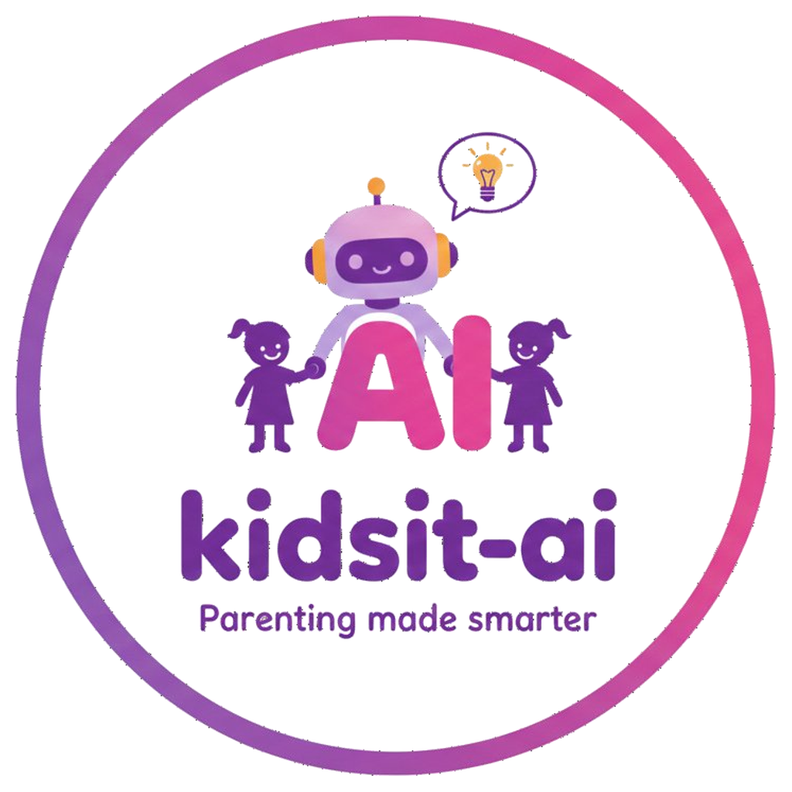

<p align="center">
  
</p>

<h1 align="center">Kidsit AI</h1>

<p align="center">
  Parenting made smarter. Speak a moment, get warm, science-backed guidance in seconds.
</p>

<p align="center">
  <a href="#features">Features</a> ·
  <a href="#stack">Stack</a> ·
  <a href="#getting-started">Getting started</a> ·
  <a href="#architecture">Architecture</a> ·
  <a href="BILLING_SETUP.md">Billing setup →</a>
</p>

---

## Features

- **Press-and-hold mic** records the parent's story, transcribes with Whisper, and sends to GPT.
- **Structured guidance** in four parts — *What happened · Why · What to try · Tonight* — generated under a tight system prompt rooted in Ginott / Faber-Mazlish parenting principles.
- **Per-kid memory** — every moment lives in local history. Past moments for the same child are scored (recency + keyword overlap + feedback signal) and fed back into the prompt so the model learns what works for this family.
- **"Did it work?" feedback** — four-way rating after each response (got worse / same / helped / really helped); failed advice is weighted heaviest so the next answer doesn't repeat it.
- **Adaptive kid selector** — pill cards for 1–2 children, horizontal-scroll avatar row for 3+, with a contextual headline ("What happened with *Maya*?") and a step-1 badge so the choice is impossible to miss.
- **7-day local trial → paid** — `LapsedScreen` blocks the app when the trial expires; monthly or yearly via Apple IAP through RevenueCat. `SubscriptionScreen` in Settings lets active subscribers manage their plan.
- **Hide-but-keep** — kid records and history stay on-device when the subscription lapses; they reappear on resubscribe.
- **iOS first** — Capacitor wraps a React + Vite WebView. Native shell built with Swift Package Manager (no CocoaPods).

## Stack

| Layer | Tech |
| ----- | ---- |
| UI | React 18 + Vite |
| Native shell | Capacitor 8 (iOS only) |
| LLM | OpenAI `gpt-4o-mini` (responses), `whisper-1` (transcription) |
| Subscriptions | RevenueCat + Apple StoreKit 2 |
| Storage | localStorage (settings, kids, history) |
| Type system | None (intentional — plain JS) |
| Build | `vite build` → `dist/` → `cap sync` → Xcode |

## Getting started

```bash
# install
npm install

# browser preview (mocked recording, no IAP)
npm run dev

# build + sync to iOS + open Xcode
npm run ios
```

You'll need a `.env` (see `.env.example`) with:

```bash
VITE_OPENAI_API_KEY=sk-...
VITE_RC_IOS_KEY=appl_...        # appl_ for production, test_ for RC test store
VITE_RC_ENTITLEMENT_ID=premium
```

For the full Apple Developer / App Store Connect / RevenueCat setup checklist, see **[BILLING_SETUP.md](BILLING_SETUP.md)**.

## Architecture

### Phase machine

`App.jsx` owns the top-level phase:

```
welcome → onboarding → trial_start → app
                                       ↓
                              (trial expires &
                               not entitled)
                                       ↓
                                 LapsedScreen
```

Inside the `app` phase, `MainApp` runs its own tab state (`home | history | kids | settings`). The Home tab has its own flow machine (`compose → thinking → response → followup`).

### Entitlement model

Three signals decide what the user can do:

- **`billing.entitled`** — RevenueCat's `Transaction.currentEntitlements` says they have an active paid `premium` entitlement.
- **`trialActive`** — local 7-day trial timer started by tapping "Start 7-day free trial." Tracked as `settings.trial.startedAt` in localStorage; expiry is computed every render.
- **`entitled || trialActive`** — gates "add kid #2+" and unlocks all locked kids beyond the first.

RevenueCat is the source of truth for paid state. localStorage is a cache for instant cold-start UI. Trial state is local only (no server).

### Theme

`src/theme.js` exports a mutable `tokens` object and an `applyTheme(name)` that does `Object.assign(tokens, THEMES[name])`. `App.jsx` calls `applyTheme(settings.theme)` in the component body — synchronously, **before** children render. Don't move it to `useEffect`, or children render once with stale colors.

### Smart prompt context

`src/openai.js → summarizePastMoments` scores past moments for the active kid:

- **Recency** (0–40): newer matters more.
- **Feedback signal** (0–30): a moment marked "got worse" outranks one marked "really helped" — the model learns more from misses than wins.
- **Keyword overlap** (0–30): Jaccard similarity between the new story and each past story.

Top 5 are re-sorted chronologically and embedded into the user prompt with feedback annotations like `[parent said this DID NOT help — got worse]`.

## Repo layout

```
src/
  App.jsx              # phase machine, billing wiring, MainApp shell
  billing.js           # RevenueCat wrapper (init, offerings, purchase, restore)
  openai.js            # prompt builder, GPT + Whisper calls, scored history
  storage.js           # localStorage IO + trial helpers
  theme.js             # mutable tokens
  recorder.js          # MediaRecorder wrapper
  components/
    FlowA.jsx          # main compose screen (kid picker, mic, context steps)
    FlowB.jsx          # dense single-page alt flow
    Response.jsx       # AI response screen
    Followup.jsx       # "Did it work?" rating + note
    History.jsx        # log of past moments + inline feedback
    Kids.jsx           # add/edit children, locked-kids upgrade CTA
    Settings.jsx       # theme, flow, subscription row, clear data
    Paywall.jsx        # trial-start mode + upgrade mode
    TrialScreens.jsx   # TrialReminderBanner, LapsedScreen, SubscriptionScreen
    Welcome.jsx        # first-launch hero
    Onboarding.jsx     # 3-slide intro carousel
ios/                   # Capacitor iOS shell (Xcode workspace, plist, assets)
```

## Status

Internal build. Not yet on the App Store. IAP wired and tested in sandbox; smart-prompt context and feedback loop validated end-to-end on device.
